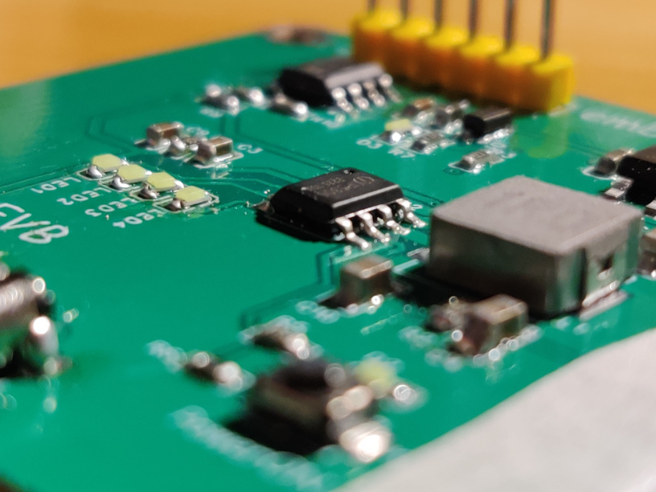

<h1 align="center">
    Xenia Clock
</h1>

<!-- 

     <a>  </a>

 -->

     

[[中文]](index.md) [[English]](index-en.md)

Table of Contents
------------------

- [Introduction](#Introduction)
- [Design](#Design)
- [Inside](#Inside)
- [License](#License)

Introduction
------------------

A fully open-sourced desktop clock gadget, including software, hardware, and more. Using an e-paper display, support network, and more functions! the platform is based on RP2040.

    

 

Design
------------------

Well, **Xenia Clock** is consists of three parts, namely **"Roof"**, **"Middle"**, **"Power"** and
each part got different work to do.

It's hard to explain in words, let's just take a look at this picture of designing structure

-----------------------

**A preview design of Xenia Clock's roof**
> the other parts of the clock are still building

**`Evaluation Board` of power supply part**

Offical Site :
[`https://embeddedboys.github.io/XeniaClock`](https://embeddedboys.github.io/XeniaClock)

Repository at :
[`https://github.com/embeddedboys/XeniaClock`](https://github.com/embeddedboys/XeniaClock)

Inside
------------------

* `MCU` - raspberrypi RP2040

* based on `PICO-SDK`

* `sub MCU` - STC8G1K08A

* `Display` - 1.54 inc E-paper fast-flush display

* `sub Dispaly` - 0.91 inc OLED display (yellow for default)

* `Network` - esp01s AT

* `Sensors` - AHT10 temperture humidity sensor

* `RTC` - DS1307/DS3221

* `Charge IC` - IP5306

* `Battery` - 200mAh lithium

LICENSE
------------------

This project was published under an MIT license, check `About -> License` for more information.

Have fun with this!

Cheers,
