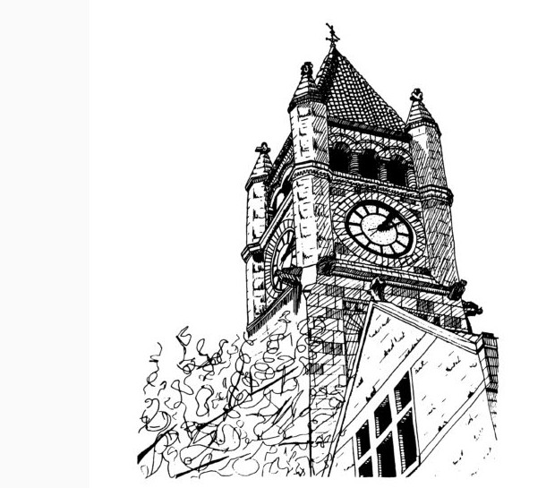
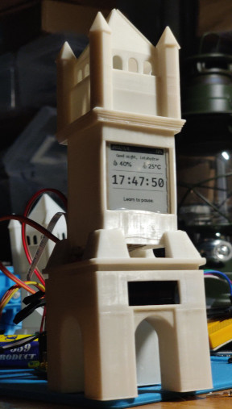
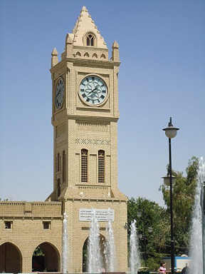
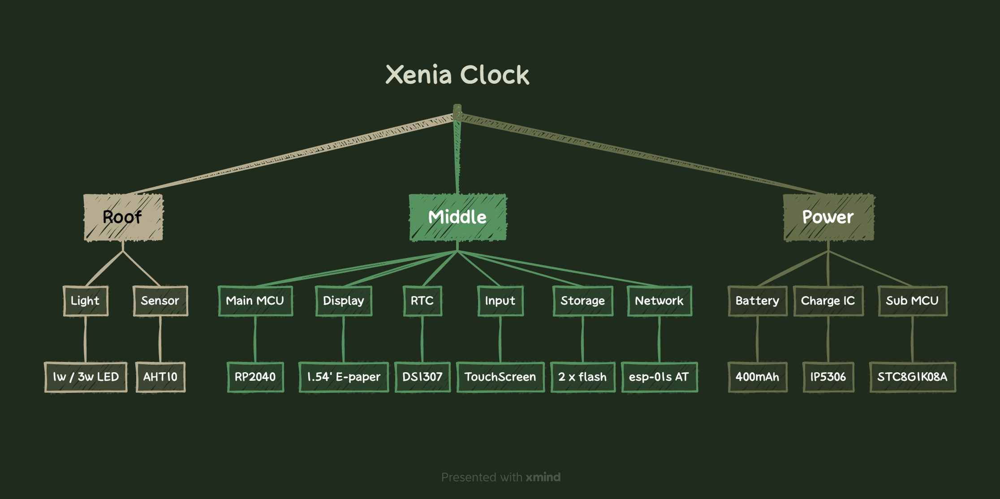
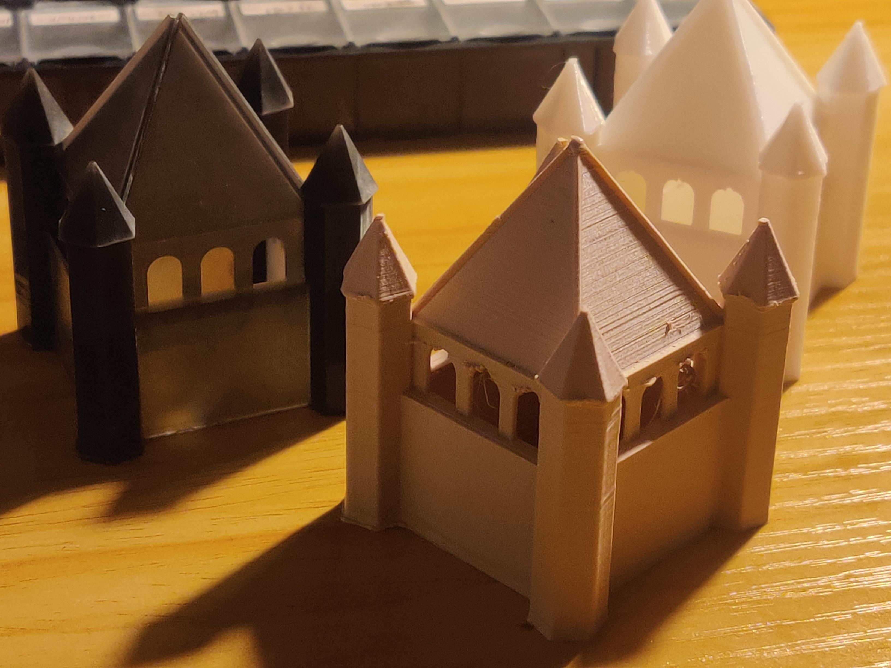
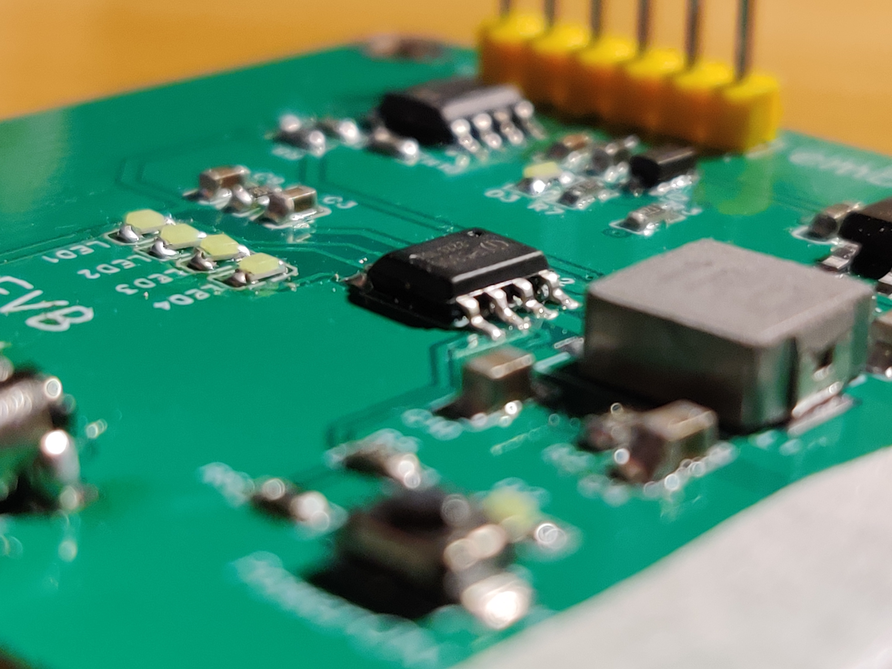

<h1 align="center">
    Xenia Clock
</h1>

<!-- 

     <a>  </a>

 -->

     

[[中文]](README.md) [[English]](README.en.md)

Table of Contents
------------------

- [介绍](#Introduction)
- [设计](#Design)
- [内部](#Inside)
- [许可证](#License)

[Gallery](gallery.md)
------------------

<h2 align="center">
    Introduction
</h2>

   

  

一个完全开源的桌面时钟小工具，包括软件、硬件等。

使用电子纸显示器，支持网络和更多功能！

官方网站 : [`https://embeddedboys.github.io/XeniaClock`](https://embeddedboys.github.io/XeniaClock)

仓库位于 : [`https://github.com/embeddedboys/XeniaClock`](https://github.com/embeddedboys/XeniaClock)

<h2 align="center">
    Design
</h2>

(这里放一张完整结构3D模型渲染图)

Xenia Clock的外形设计，很大程度上的参考了如下建筑

 

> left : Xenia Clock, Ohio, USA
> right : Erbil Clock Tower

Huh，**Xenia Clock** 由三部分组成，**楼顶**、**中间**、**电源**，每个部分都有不同的工作要做。

对设计框图感兴趣吗？

-----------------------

**Xenia Clock屋顶的预览设计**
> 时钟的其他部分还在建造

**`Evaluation Board` 供电板**

<h2 align="center">
    Inside
</h2>

| 零件 | 型号 |
| ---- | ----- |
| `主 MCU`      | RaspberryPi RP2040 双核 `133MHz` `288K SRAM`|
| `闪存`         | `4MB` 2x W25Q16
| `Power MCU`   | STC8G1K08A |
| `主屏幕`       | `1.54`寸墨水屏 |
| `副屏幕`       | `0.91`寸OLED                        |
| `网络`         | esp-01s AT|
| `传感器`       | AHT10 |
| `实时钟`       | DS1307 / DS3231 |
| `充放电管理`    | IP5306 |
| `照明` | 1x `1W` LED灯珠 或 4x `0.3W` 陶瓷灯丝
| `电池`         |  `400mAh` 锂电 |
有关这部分的详细信息，可以到官网硬件文档查看

<h2 align="center">LICENSE</h2>

此项目是在MIT许可证下发布的，有关详细信息，请查看`关于->许可证`。

玩得开心！

Cheers,
