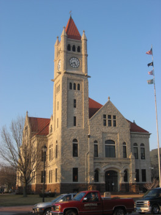

<h1 align="center">
    Xenia Clock
</h1>

<!-- 

     <a>  </a>

 -->

     

[[中文]](README.md) [[English]](README.en.md)

Table of Contents
------------------

- [介绍](#Introduction)
- [设计](#Design)
- [内部](#Inside)
- [许可证](#License)

[画廊](gallery.md)
------------------

<h2 align="center">
    Introduction
</h2>

   

  

**Xenia Clock** 是一个基于墨水屏的电子时钟

顺便说一句，这是一个完全开源的项目，意味着你可以得到任何关于本项目的资料。

官方网站 : [`https://embeddedboys.github.io/XeniaClock`](https://embeddedboys.github.io/XeniaClock)

仓库位于 : [`https://github.com/embeddedboys/XeniaClock`](https://github.com/embeddedboys/XeniaClock)

## Design

从零开始制作一个桌面时钟小工具，听起来不错，而且应该也不太难，应该几天就能搞定，
我这么告诉我自己，进展很顺利，一开始也确实如此。很快，项目的原型都已经做出来了。

但是随着项目的进展，我在想，这样是不是有点太随便了。我做这些项目，很大程度上是为了
锻炼自己的能力。我说，做一个项目，要像读一本书一样，如果不能消除自己的无知，
那就没有必要做下去了。后来我打算把这个项目当产品来做，其实也有其他原因，因为这个
项目的很多东西，都可以复用到其他项目上。

从来没有以产品级的标准去做一个项目，随着研究调查的进行，我才发现，需要做的东西太
多了，而且以前从来都没有考虑过，因为做一个demo，不需要考虑任何不利因素，只需实现
功能。我开始意识到问题的严重性，比如充放电管理，照明驱动电路，电源设计等，这些都是我
从未涉足的领域。幸亏这是一个基于MCU的项目，要不然这个项目真的没法进行下去了。

就跟开头说的那样，项目又逐渐恢复了进度，我一边设计硬件，一边设计软件。。。。

### 硬件

最先下手的，当然是主板了

（图）

其次是供电板

**`Evaluation Board` 供电板**

然后是灯板

（图）

设计过程中，主板又做了核心板+底板的设计

（图）

### 软件

软件项目是基于pico-sdk开发的，但因为个人习惯，引入了很多linux的设计原则。
这部分虽然不算枯燥乏味，但比起其他部分，不能够引人注目，所以这里简单带过。
更详细的说明可以到官网文档中查看。

前期主要就是开发显示的驱动，并且把lvgl移植到了上面。

编写rtc功能。

为aht10这些传感器编写接口

用esp-01s AT写了配网过程，又做了个个小型web服务器，用来跟设备交互。

后来因为复杂度的上升，又引入了FreeRTOS

后来又引入了littlefs文件系统，在华邦的spiflash上

### 结构

其实我在设计软硬件的过程中，就已经在对项目的结构，作出了种种幻想。火柴盒，还有
屏占比高的设计都想过，但是都不符合我对这个项目的定义。后来，我就在想为什么不把这个
做成一座像建筑一样的东西呢？这正是我所期待的，神秘感。这样看来，似乎钟楼这种建筑最适合了。
很好，接下来就是选些参照物作原型设计了。

 

> 左 : Xenia Clock, Ohio, USA  右 : Erbil Clock Tower

Xenia Clock（这里说的是建筑），非常符合我对功能的要求，比如楼顶的开窗可以做照明，
中间其实都差不多，拿来放显示屏和主板，一些重要部件，但是它的底部不是很好，太单一。
所以我又参考了Erbil Clock Tower的底部，因为要放供电部分，以及副屏之类的，底部的
拱门设计也很好。

**Xenia Clock屋顶的预览设计**

最后，结构的效果如下：

(这里放一张完整结构3D模型渲染图)

-----------------------

## Inside

| 零件 | 型号 |
| ---- | ----- |
| `主 MCU`      | RaspberryPi RP2040 双核 `133MHz` `288K SRAM`|
| `闪存`         | `4MB` 2x W25Q16
| `Power MCU`   | STC8G1K08A |
| `主屏幕`       | `1.54`寸墨水屏 |
| `副屏幕`       | `0.91`寸OLED                        |
| `网络`         | esp-01s AT|
| `传感器`       | AHT10 |
| `实时钟`       | DS1307 / DS3231 |
| `充放电管理`    | IP5306 |
| `照明` | 1x `1W` LED灯珠 或 4x `0.3W` 陶瓷灯丝
| `电池`         |  `400mAh` 锂电 |
有关这部分的详细信息，可以到官网硬件文档查看

<h2 align="center">LICENSE</h2>

此项目是在`MIT`许可证下发布的，有关详细信息，请查看`关于->许可证`。

玩得开心！

Cheers, iotah
